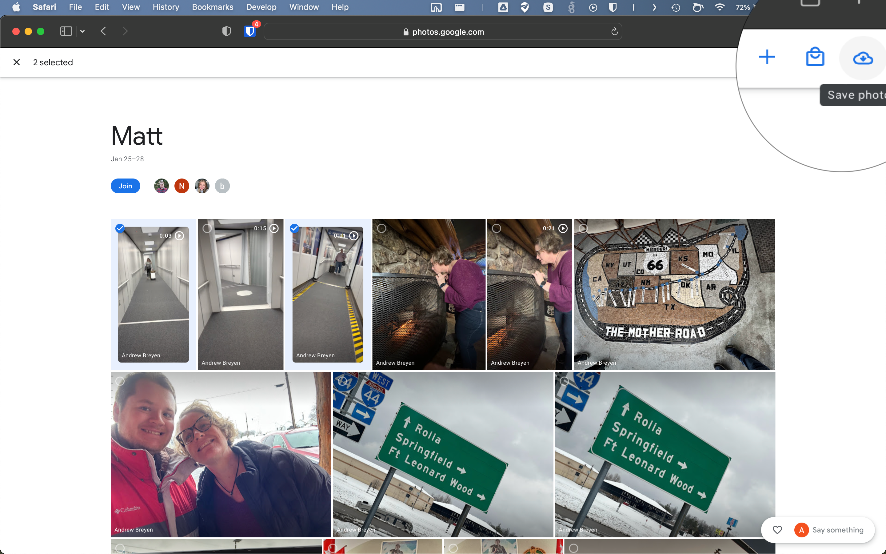

# Google Photos Shared Album

## Add to Album

1. Open Album
2. Click '+' 
    
    { width="30%"}

3. Enter google account to share to:
    
    { width="30%"}

4. Ensure 'Link Sharing' remains turned off
    
    { width="30%"}

## Accept Album

1. Email:  Click 'View Album'
    
    !!! warning
        
        Save the email to access album later. 

    { width="30%"}

2. Click 'Join'

    { width="30%"}
    !!! note

        I am getting stuck here, currently not saving album to my library.

## Save Items

### Individual Pictures
1. Click picture

    { width="30%"}

1. Click save

    { width="30%"}

### Multiple
1. Check multiple pictures

    { width="30%"}

2. Click cloud icon in top right

    { width="30%"}

## Add Items

1. From album page, click 'Add Photos'

    { width="30%"}

1. Select photos, click 'Done' { width="10%"}

    { width="30%"}

