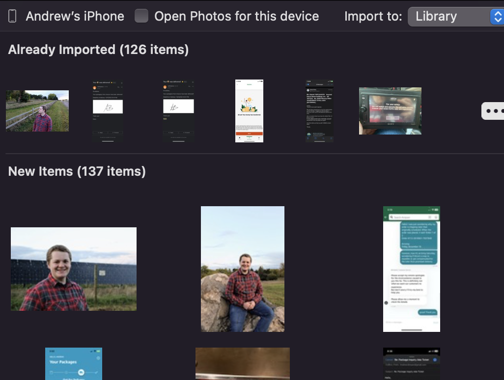

# Import photos from iPhone to Photos app

1. Plug phone into computer
    - If prompted, select 'Trust' or 'Allow'
2. Open photos app
3. Select phone in sidebar

    { width="150" }

4. Photos are shown. You can choose to 'import all new items' or just select specific items to import. 

    { width="300" }
